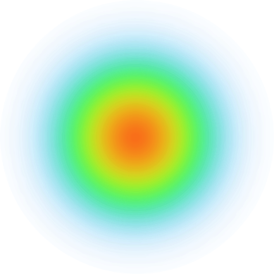

# <div align="center"><br> Round Spot</div>

<div align="center">
  An easy to use heat map interface analysis library
  
  <a href="https://github.com/stasgora/round-spot/actions"></a>
  <a href="https://github.com/tenhobi/effective_dart"></a>
  <a href="https://github.com/stasgora/round-spot/blob/master/LICENSE"></a>
</div>

**Round Spot** simplifies the UI accessibility and behaviour analysis for Flutter applications by handling the data gathering and processing. It produces beautiful heat map visualizations that aim to make the UI improvement and troubleshooting easy and intuitive.

## 🚧 State 🚧
This tool is still in active development - the core functionality is mostly working but many important features are still missing.

## Usage
> **⚠️ Note:** This package is not yet published to `pub.dev`

To start using **Round Spot** within your app, import it in your main file:
```dart
import 'package:round_spot/round_spot.dart';
```

### Setup
Wrap your `MaterialApp` widget to initialize the library:
```dart
void main() {
  runApp(RoundSpot.initialize(
    child: Application(),
  ));
}
```
Add an observer for monitoring the navigator:
```dart
MaterialApp(
  navigatorObservers: [ RoundSpotObserver() ],
)
```

### Configuration
Provide the callbacks for saving the processed output:
```dart
RoundSpot.initialize(
  heatMapCallback: (data) => sendHeatMapImage(data)
)
```
Configure the tool to fit your needs:
> **⚠️ Note:** Configuration is very much a **WIP**
```dart
RoundSpot.initialize(
  config: RoundSpotConfig(
    minSessionEventCount: 30,
    outputTypes: { OutputType.graphicalRender },
    heatMapStyle: HeatMapStyle.smooth
  ),
)
```

## Contributors
Created by [Stanisław Góra](https://github.com/stasgora/)

## License
This tool is licenced under [`MIT License`](https://github.com/stasgora/round-spot/blob/master/LICENSE)
